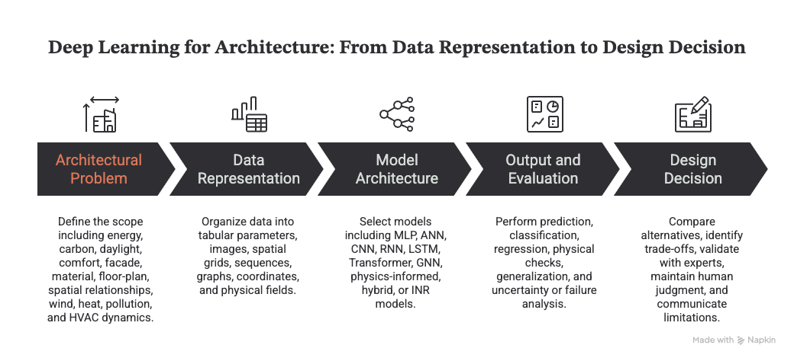

# Modules 2–3 — Machine Learning and Deep Learning for Architecture

Purpose: detailed teaching content, demonstrations, and English diagram prompts for short instructional videos  
Audience: architecture and built-environment students with basic data-literacy knowledge  
Central question: How can architectural data be transformed into evaluated machine-learning models and, when appropriate, more specialized deep-learning systems that support responsible design decisions?

## Combined learning outcomes

By the end of Modules 2–3, students should be able to:

- Distinguish supervised, unsupervised, semi-supervised, and reinforcement learning.
- Translate an architectural question into features, targets, data representations, and a suitable learning task.
- Explain the complete machine-learning workflow from preprocessing through deployment and monitoring.
- Build and evaluate regression and classification models using task-appropriate metrics.
- Explain feature selection, multicollinearity, generalization, underfitting, overfitting, and cross-validation.
- Explain the structure and training process of an artificial neural network.
- Match MLPs, CNNs, sequence models, Transformers, GNNs, physics-informed models, and INRs to suitable architectural data.
- Evaluate technical accuracy, physical plausibility, domain transfer, uncertainty, and design usefulness.

Core message:

> Begin with the architectural question and the data. Select the simplest model that can answer the question reliably, evaluate it on unseen data, and keep domain knowledge and human judgment in the decision loop.

## Module 2 — Machine Learning Fundamentals

1. **Episode 2.1 — ML Types and the Complete Workflow**
2. **Episode 2.2 — Why Statistics and Probability Matter**
3. **Episode 2.3 — Regression: Predicting Continuous Outcomes**
4. **Episode 2.4 — Classification: Predicting Categories**
5. **Episode 2.5 — Generalization and Reliable Model Evaluation**
6. **Episode 2.6 — Demo: UW Campus Building-Energy Regression**

### Episode 2.3 — Regression: Predicting Continuous Outcomes

#### Central question {#regression-central-question}

How can building characteristics be used to predict a continuous performance outcome such as annual energy consumption?

#### Regression versus classification {#regression-versus-classification}

Regression predicts a number on a continuous scale. Classification predicts which discrete category an example belongs to.

#### How linear regression works {#how-linear-regression-works}

For one feature, a fitted line predicts an outcome with **ŷ = wx + w₀**. Here, *x* is a known building feature, *w* is the learned slope, and *w₀* is the intercept. Each vertical gap between an observed point and its prediction is a residual: **error = actual − predicted**.

With several building features, the same idea becomes **ŷ = w₁x₁ + w₂x₂ + … + wₙxₙ + w₀**. Each coefficient describes the model's fitted relationship with one feature while the other included features are held constant.

#### Architectural example {#regression-architectural-example}

The observed annual building energy consumption is the target **Y**. The model learns coefficients from buildings where both X and Y are known, then uses those coefficients to predict ŷ for unseen buildings.

#### Model evaluation {#regression-model-evaluation}

  <section><strong>Prediction error</strong>
The difference between an observed energy value and the model's prediction.
</section>
  <section><strong>RMSE</strong>
RMSE summarizes prediction error in the target's unit and gives larger errors more weight. Lower is better.
</section>
  <section><strong>R²</strong>
The proportion of variation in the target explained by the fitted model on the evaluated data.
</section>

> A high R² does not by itself prove that the model is reliable or that a feature causes energy consumption to change. Check unseen-data error, residuals, data quality, and domain plausibility.

### Episode 2.6 — Demo: UW Campus Building-Energy Regression

#### Guided workflow {#regression-guided-workflow}

This demonstration follows the supplied assignment notebook without reproducing its setup cells or completing its student TODOs as if they were submitted answers. Each checkpoint executes actual Python in the browser against the real UW CSV. Python loads only when this episode is opened.

#### Interactive feature selection {#regression-interactive-feature-selection}

Choose model inputs, then select **Train model**. The browser applies the assignment's outlier rules, uses a reproducible 80/20 split, fits ordinary least squares on the training rows, and updates every result from the loaded data.

#### Final exercise {#regression-final-exercise}

## Module 3 — Deep Learning for Architecture

Module question: How can different deep-learning architectures process tabular data, images, graphs, sequences, coordinates, and physical systems?

*Figure 1. Deep Learning for Architecture — from data representation to design decision. Created for this module.*

### Episode 3.1 — From an artificial neuron to a deep network

#### Central question

How can a network of simple mathematical units learn a complex relationship between building geometry, climate, and performance?

#### Artificial neuron

An artificial neuron is a mathematical function, not a realistic simulation of a biological neuron.

An artificial neuron contains:

- Inputs: building area, height, window-to-wall ratio, orientation, materials, weather, or other features.
- Weights: values learned during training that represent the relative influence of each input.
- Bias: a learned value that shifts the neuron's response.
- Weighted sum: the combination of inputs and weights.
- Activation function: a transformation that introduces a nonlinear response.
- Output: a value passed to the next layer or used as the final prediction.

Basic relationship:

> Inputs x1, x2, ..., xn → z = sum(wi × xi) + b → a = activation(z) → output

#### Network layers

- Input layer: receives building parameters, climate, images, graphs, sensors, or simulation data.
- Hidden layers: learn intermediate representations and complex interactions.
- Output layer: produces a prediction, class, segmentation, generated representation, or physical field.

#### Shallow versus deep networks

- A shallow network usually has one or two hidden layers and is suitable for relatively simple, structured problems.
- A deep network has multiple hidden layers and can learn increasingly abstract representations.
- A deeper network is not automatically a better network.
- Greater capacity increases requirements for data, computation, tuning, and validation.

#### Common activation functions

- ReLU: commonly used in hidden layers; passes positive values and suppresses negative values.
- Sigmoid: maps output between 0 and 1; useful for binary probabilities.
- Softmax: converts several class scores into multiclass probabilities.
- Linear output: useful for continuous regression targets.
- Tanh: maps output between -1 and 1; historically common in sequence models.

#### Architectural example

> Building area + height + window-to-wall ratio + orientation + weather → MLP hidden layers → predicted annual energy use

#### Interactive mini code lab — run an artificial neuron

Change the input values, weights, or bias below. Select **Run code** to calculate the weighted sum and the ReLU output directly in the browser.

### Episode 3.2 — How neural networks learn

#### Central question

When a neural network makes a wrong prediction, how does it determine which weights to change?

#### Complete training loop

1. Split data into training, validation, and test sets.
2. Forward pass: inputs move through the network and produce a prediction.
3. Compute loss: compare the prediction with the known target.
4. Backpropagation: calculate how each weight contributed to the error.
5. Optimization: update weights to reduce the loss.
6. Validation: measure performance on data not used for weight updates.
7. Repeat across batches and epochs.
8. Evaluate once on the untouched test set.

#### Key terms

- Parameter: a weight or bias learned from data.
- Hyperparameter: a setting selected or searched by the researcher, such as layer count, neuron count, learning rate, batch size, optimizer, dropout rate, or epoch count.
- Batch: a subset of training examples used for one update.
- Epoch: one complete pass through the training dataset.
- Learning rate: the size of each weight update.
- Loss function: the training objective that the model minimizes.
- Optimizer: the update strategy, such as gradient descent, SGD, or Adam.

#### Loss examples

- Regression: mean squared error or mean absolute error.
- Classification: binary or categorical cross-entropy.
- Physics-informed learning: data loss + equation or physics loss + boundary or initial-condition loss.

#### Architectural interpretation

> A model does not understand energy automatically. It learns the relationship encouraged by the data, representation, loss function, and constraints selected by the researcher.

### Episode 3.3 — Generalization, overfitting, and reliable evaluation

#### Central question

Why can a model perform extremely well on training data but fail on a new building or climate?

#### Three model states

- Underfitting: the model is too simple or insufficiently trained; training and validation errors are both high.
- Good generalization: training and validation performance are both acceptable and remain close.
- Overfitting: training performance continues to improve while validation performance stops improving or becomes worse.

#### Regularization strategies

- Dropout: randomly disables some neurons during training.
- Weight decay: discourages unnecessarily large weights.
- Batch normalization: stabilizes activation distributions and training.
- Early stopping: stops training when validation performance no longer improves and retains the best weights.
- Data augmentation: creates meaningful variations without changing the target meaning.
- Cross-validation: repeats training and validation across different data folds.
- Simpler architecture: reduces unnecessary depth and parameter count.

#### Evaluation must match the task

- Regression: MAE, RMSE, R², residual patterns, and errors across building types or climates.
- Classification: confusion matrix, accuracy, precision, recall, F1, and the consequences of false positives and false negatives.
- Image segmentation: intersection over union, Dice score, boundary quality, and failures under different image conditions.
- Physical-field prediction: pointwise error, field-pattern accuracy, boundary adherence, conservation or physical residual, and extreme-condition performance.
- Design generation: constraint satisfaction, diversity, feasibility, performance, expert review, and human usefulness.

#### Architecture-specific generalization tests

- New buildings from the same dataset.
- A building type absent from training.
- A different city or climate zone.
- A different geometric scale or topology.
- Extreme weather or operating conditions.
- Noisy or incomplete sensor data.

Important warning:

> Random train/test splitting can overestimate performance when neighboring buildings, repeated simulations, time-adjacent samples, or nearly identical geometries appear in both sets.

### Episode 3.4 — CNN and computer vision for architecture

#### Central question

How does a neural network move from raw pixels to architectural features and decisions?

#### CNN workflow

1. Input an image, map, voxel grid, or simulation raster.
2. Convolution filters detect local patterns.
3. Feature maps encode edges, textures, shapes, and higher-level structures.
4. Activation functions introduce nonlinearity.
5. Pooling or downsampling reduces spatial resolution and compresses information.
6. Deeper layers combine local features into abstract representations.
7. The output head produces a class, bounding box, segmentation mask, numerical prediction, or generated image.

#### Architectural applications

- Facade material classification.
- Window, door, roof, and building-feature detection.
- Construction progress, defect, and safety monitoring.
- Street-view, aerial-image, and satellite urban analysis.
- Accessibility and visual-design evaluation.
- Grid-based solar, wind, thermal, and pollution-field surrogate modeling.

#### Example workflow

> Street-view facade images → image quality control and labels → CNN feature extractor → material classification → confidence and confusion matrix → GIS aggregation → human verification

#### Risks and limitations

- Geographic and visual-data bias.
- Differences in cameras, lighting, occlusion, seasons, and image quality.
- The model may learn background context instead of the intended architectural feature.
- Visible material does not reveal the complete wall assembly or performance.
- Grid-based CNNs can struggle with irregular geometry and very high-resolution 3D domains.

### Episode 3.5 — Graphs, GNNs, and spatial relationships

#### Central question

Images describe appearance, but how can AI represent relationships among rooms, systems, buildings, or urban networks?

#### Graph representation

- Node: a room, facade, sensor, building, or urban block.
- Edge: adjacency, circulation, visibility, airflow, similarity, or energy exchange.
- Node features: area, program, occupancy, temperature, and material.
- Edge features: distance, connection type, shared boundary, direction, capacity, and flow.
- Global features: site, climate, project target, and building-level properties.

#### GNN message passing

1. Each node begins with its own features.
2. The node receives messages from connected neighbors.
3. Neighbor messages are aggregated.
4. The node updates its representation.
5. Multiple layers allow information to travel farther through the graph.
6. The model predicts node labels, edge relationships, graph-level properties, or new structures.

#### Architectural applications

- Room adjacency and circulation reasoning.
- Floor-plan analysis or generation.
- Building-system and energy-network modeling.
- Urban accessibility and mobility relationships.
- Mesh-based physical-field approximation.
- Knowledge graphs linking buildings, materials, performance, and regulations.

#### Hypergraph distinction

- A normal graph edge usually connects two nodes.
- A hyperedge can connect several nodes simultaneously.
- A hyperedge can represent one apartment, shared circulation zone, functional group, or multi-room relationship.

Critical distinction:

> A graph is a data representation. A GNN is a neural model that learns on graphs. A hypergraph model, adjacency algorithm, or self-organizing map is not automatically a GNN.

#### Spatial workflow

> Program requirements → room nodes → adjacency and access edges → graph or hypergraph → optional GNN → geometry-generation rules → candidate floor plans → daylight, carbon, circulation, and space-efficiency evaluation → designer selection

#### Research example

Weber, Mueller, and Reinhart use a hypergraph to encode floor-plan organization and support automatic geometry generation. Within that study, improved space efficiency outperformed envelope upgrades for operational carbon in 72% of surveyed Zurich buildings, 61% in New York, and 33% in Singapore. A Zurich case study increased daylight access by up to 24%. These figures must remain connected to the study's datasets, assumptions, and evaluation scope.

### Episode 3.6 — Physics-informed learning, surrogate models, and INRs

#### Central question

Can a model provide fast simulation feedback while remaining physically plausible under unseen conditions?

#### Modeling spectrum

##### Physics-based simulation

- Uses governing equations, boundary conditions, material properties, and numerical solvers.
- Strength: an explicit physical foundation.
- Limitation: high computational cost and difficult modeling or calibration.

##### Purely data-driven model

- Learns relationships from measured or simulated examples.
- Strength: fast inference after training.
- Limitation: may violate physics or fail outside the training range.

##### Hybrid or gray-box model

- Combines a simplified physical model with learned components.
- Useful when some mechanisms are known and others are difficult to model.

##### Physics-informed machine learning

- An umbrella term for introducing physical knowledge into machine learning.
- Physics may enter as inputs, features, architecture, loss terms, bounds, monotonic relationships, conservation rules, or model ensembles.

##### Physics-informed neural network — PINN

- A specific neural-network method within physics-informed learning.
- Usually adds governing-equation residuals and boundary or initial conditions to the loss.
- Can learn from both observations and physical constraints.
- It is not automatically superior; complex boundaries, stiff equations, scale, and optimization can remain difficult.

##### Surrogate model

- Approximates a slower high-fidelity simulator.
- Supports rapid repeated prediction during design exploration, optimization, or control.
- Reliability is limited by the simulation dataset, parameter range, geometry representation, and validation method.

##### Implicit neural representation — INR

- Represents geometry or a physical field as a continuous coordinate-based neural function.
- Coordinates plus a learned shape encoding can produce wind velocity, temperature, pressure, or another field variable.
- Useful for complex geometry, continuous physical fields, and flexible-resolution queries.
- An INR is not automatically physics-informed; physical constraints must be added explicitly when required.

#### HVAC example

> Weather + HVAC control + occupancy + current indoor temperature → data model plus physical constraints → next-step indoor temperature → comfort and energy-control decision

#### Building-aerodynamics surrogate example

> Building geometry → geometry encoder or latent representation → neural surrogate or neural field → wind or thermal field → pedestrian-comfort and facade-pressure metrics → rapid design iteration

#### Validation requirements

- Compare against independent simulation or measurement.
- Test different geometries, scales, climates, and boundary conditions.
- Report field error, extreme-value error, physical residual, and uncertainty.
- Mark interpolation and extrapolation regions.
- Keep high-fidelity simulation or expert review in the loop for critical decisions.

## Accuracy boundaries for scripts and diagrams

- Do not describe neural networks as systems that literally think like a human brain.
- Do not interpret correlation as causation.
- Do not interpret a p-value as the probability that a hypothesis is true or as evidence of practical importance.
- Do not interpret high R² or accuracy as sufficient evidence of reliability.
- Do not present deeper networks as automatically more accurate.
- Do not use test data for hyperparameter tuning.
- Do not allow records from the same building or simulation family to leak across training and test sets.
- Do not describe a graph, hypergraph, adjacency algorithm, or self-organizing map as a GNN unless a neural message-passing model is used.
- Do not use physics-informed ML, PINN, hybrid model, surrogate model, and INR as interchangeable terms.
- Do not imply that a fast surrogate always replaces high-fidelity simulation.
- Do not treat a realistic visual output as evidence of constructability or performance.
- Always state the data range, geometry range, climate range, metrics, uncertainty, and known failure conditions.

Before public production, verify each external figure, numerical claim, DOI, publication status, and license. Prefer redrawing explanatory diagrams in the team's own visual language.
